# Web API SvelteKit Client: Part 1 - display products

Enda Lee 2022

### Quick Start

1. Download the start site from this repository.
2. Open in VS Code.
3. In a terminal run `npm install`.
4. Start the application using `npm run dev`.


## Introduction

This tutorial will use **SvelteKit** to create a client website which will uses the JavaScript Fetch API to request and display data from the web API created previously.

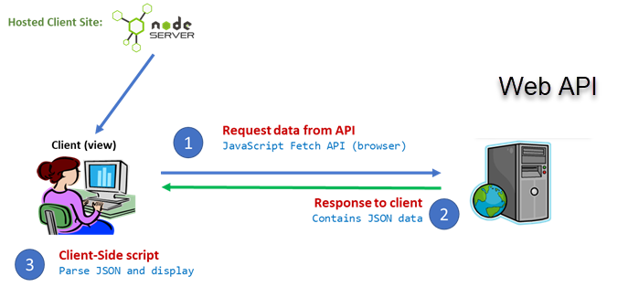


## 1. Pre-requisites

The application will use **separate** **`client`** and **`server`** applications which should be opened in separate VS Code instances when working on this lab.

##### Server-side

The client functionality is dependent on a server API with Category and Product endpoints. Make sure that the server API is running and listening on http://localhost:5001


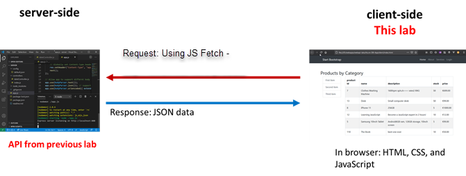

The client site/ application will fetch its data from the server-side API running on http://localhost:5001


## 2. Site structure

#### 2.1. Site root

When http://localhost:5173 loads first, the empty default page looks like the following. 

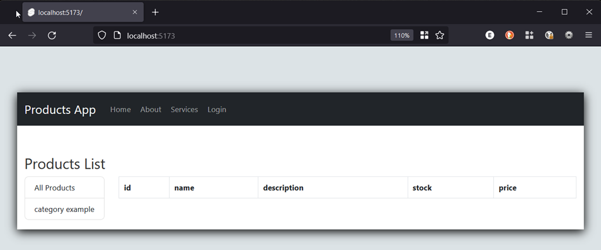


This page will act as a template for displaying category and product details. It is served from **`srd/routes/+page.svelte`**

After the products are retrieved, they will be displayed in the `HTML table`. The table body, which has `id="productRows"` will be populated using `JavaScript`. The product data will be requested from the API.

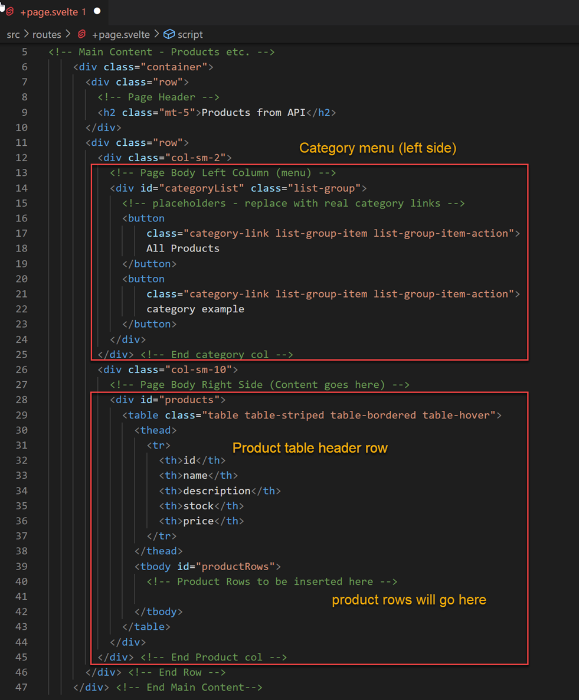


#### 2.2  Page Layout

**`+layout.svelte`** defines the common layout and navigation elements shared by all of the pages in the site. The **`routes`** folder includes a number of sample pages including login, about, and services.

Styling is based on **Bootstrap 5.2** which is loaded in **`app.html`**, with additional css defined in **`static\css\style.css`**.


## 3. Retrieving data from the Server API (Supabase)

In this section we will add functionality to get and store data Supabase via the database API. 

#### 3.1 Set up the Supabase client

1. Start by installing support for the **Supabase** client using **npm** in the CS Code terminal.

```bash
npm install @supabase/supabase-js
```

2. Set **environment variables** in **`.env`**

   Create this file in the root of your application or make a copy of **`.env.example`** from the start project (this repository), renaming it to **`.env`**.

   **`.env`** contains two variables:

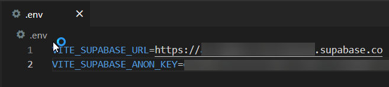


These values are specific to the Supabase product database set up previosly, and can be found in your database dashboard:

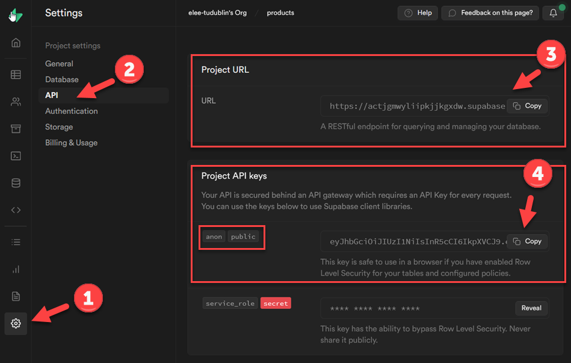


3. Setup  the supabase client in the application

   Start by adding the file **`supabase.js`** in  **`src\lib`**. If the **`lib`** folder does not exist then create it first.

   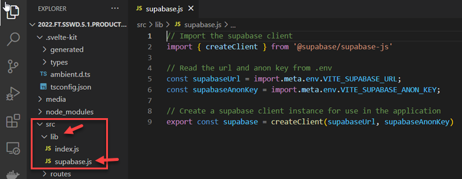

The purpose of this script is to create a Supabase client instance based on your database URL and access key. 

```javascript
// Import the supabase client
import { createClient } from '@supabase/supabase-js'

// Read the url and anon key from .env
const supabaseUrl = import.meta.env.VITE_SUPABASE_URL;
const supabaseAnonKey = import.meta.env.VITE_SUPABASE_ANON_KEY;

// Create a supabase client instance for use in the application
export const supabase = createClient(supabaseUrl, supabaseAnonKey)
```


#### 3.1. Add a SvelteKit store

The framework includes the **store** feature to manage and persist data and session state in the application. Add a folder named **stores** to the **`src`** folder. Then add **`productStore.js`** to  **`stores`**:

 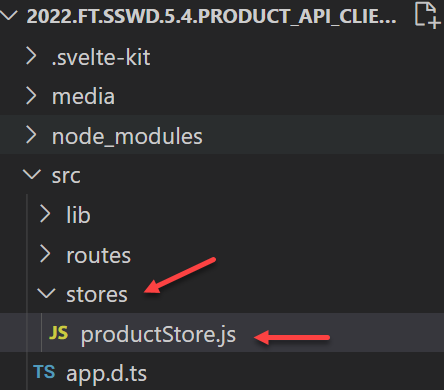


The store script defines two **writable store objects** for **`products`** and **`categories`**  plus the functions which will be used to fetch data from the API.

There are three functions

- `**getAllProducts()`**
- `**getAllCategories()`**
- `**getProductsByCat()`**

 *Read the code comments for details.* 

**`productStore.js`** code:

```javascript
// import dependencies
import { writable } from 'svelte/store';
import {supabase} from "$lib/supabase.js";

// two writable stores for products and categories
export const products = writable([]);
export const categories = writable([]);

// Function to get all products
// This uses the Supabase client to query the product table
export const getAllProducts = async () => {
        
    const {data, error} = await supabase
        .from('product')
        .select()
        .order('product_name', {ascending: true});

    if(error) {
        return console.error(error);
    }

    // @ts-ignore
    products.set(data);
}

// Function to get all categories
// This uses the Supabase client to query the category table
export const getAllCategories= async () => {
        
    const {data, error} = await supabase
        .from('category')
        .select()
        .order('category_name', {ascending: true});

    if(error) {
        return console.error(error);
    }

    // @ts-ignore
    categories.set(data);
}

// Get products by category id
export const getProductsByCat = async (cat_id = 0) => {

    if (cat_id > 0) {

        const {data, error} = await supabase
            .from('product')
            .select()
            .eq('category_id', cat_id)
            .order('product_name', {ascending: true});

        if(error) {
            return console.error(error);
        }
    
        // @ts-ignore
        products.set(data);

    } else {
        getAllProducts();
    }
}

// initialise the store
getAllProducts();
getAllCategories();


```


## 4. Displaying the data

Product and Category data will be displayed in the default page, **`src\routes\+page.svelte`**, as described above.

First, the stores and other dependencies must be imported into the page.

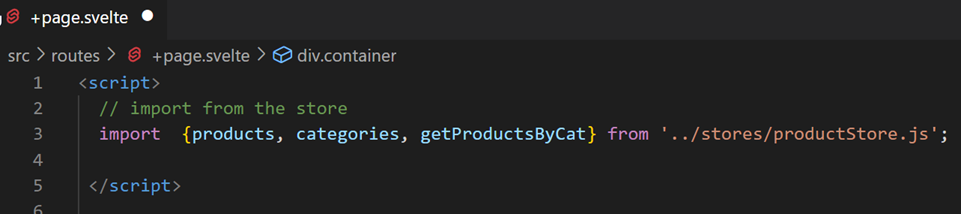


#### 4.1 Display Categories

The **categories store** contains everything from the the category table in the database (provided by the API). We can iterate through the list and display. each as a link in the left menu of the page.

Also note the All categories link.

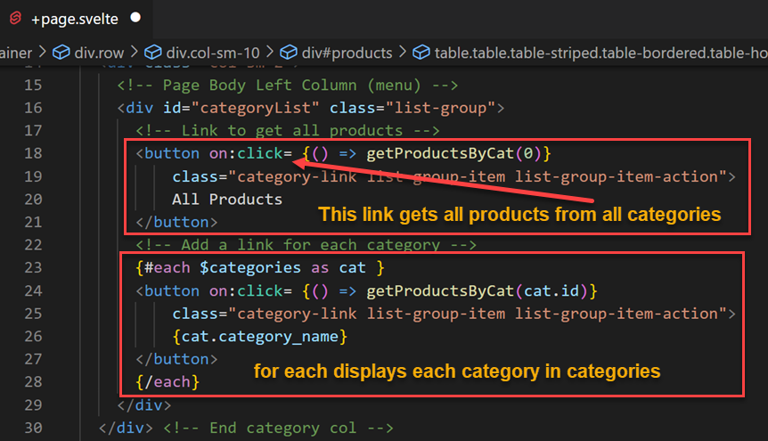


When the button links are clicked (`on:click`) the `getProductsByCat()` function is called, passing the `category id` as a parameter. This allows he list of products to be filtered.

Also note the **`$`** symbol before categories in line 23. This signifies access to the store data . The page can also listen for changes to the categories store and update the view.


#### 4.2 Display Products

This is similar to categories.  Again there is a subscription to  **`$products`** so that the page is updated whenever the store updates. You will see this when a category link is clicked.

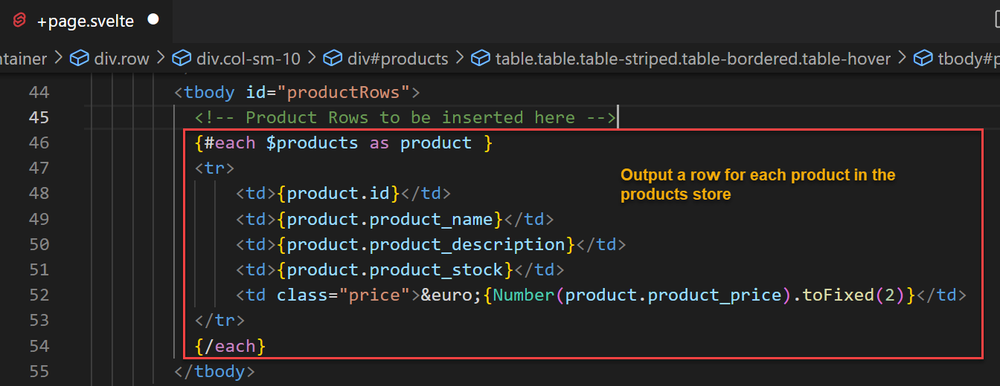


## Test the Application

First **open and start the server API app**, so that it is running and ready for http connections. Then start the SvelteKit ap.

In a web browser, open http://localhost:5173. The page should load and display the data.

Check for details in the browser console where you will say the result of any logging, errors, etc.

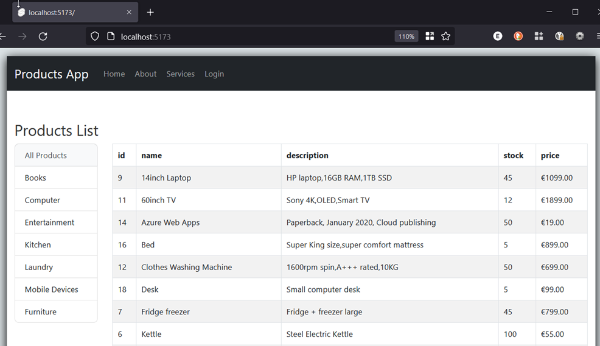


------

Enda Lee 2022
